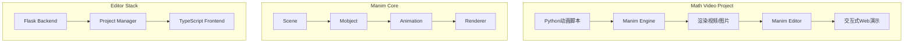

# AGENTS.md

This file provides guidance to Verdent when working with code in this repository.

## Table of Contents
1. Commonly Used Commands
2. High-Level Architecture & Structure
3. Key Rules & Constraints
4. Development Hints

---

## Commands

### Manim (数学动画引擎)

```bash
# 安装环境 (使用uv, 装在本地.venv)
uv venv .venv
source .venv/bin/activate && uv pip install -e ./manim

# 渲染动画
source .venv/bin/activate && manim render <scene.py> <SceneName>
source .venv/bin/activate && manim render -ql <scene.py>  # 低质量快速预览
source .venv/bin/activate && manim render -qh <scene.py>  # 高质量

# 代码质量
source .venv/bin/activate && ruff check manim/
source .venv/bin/activate && mypy manim/

# 测试
source .venv/bin/activate && pytest manim/
source .venv/bin/activate && pytest manim/ -k "test_name"  # 单个测试
```

### Manim Editor (Web编辑器/演示工具)

```bash
# 安装环境
source .venv/bin/activate && uv pip install -e ./manim_editor

# 前端构建
cd manim_editor && npm ci && npm run build_release

# 运行编辑器
source .venv/bin/activate && manedit
source .venv/bin/activate && manim_editor  # 别名

# 导出演示
source .venv/bin/activate && manedit --quick_present_export

# 代码质量
source .venv/bin/activate && black manim_editor/
source .venv/bin/activate && isort manim_editor/
source .venv/bin/activate && mypy manim_editor/
```

---

## Architecture

### Manim - 核心动画引擎

```
manim/
├── animation/          # 动画系统 (淡入、变换、移动等)
├── mobject/            # 数学对象 (图形、文字、公式)
│   ├── geometry/       # 几何形状
│   ├── text/           # 文本和LaTeX
│   └── svg/            # SVG解析
├── camera/             # 相机和场景视角
├── renderer/           # 渲染后端 (Cairo/OpenGL)
├── scene/              # 场景基类和生命周期
└── cli/                # 命令行接口
```

**数据流：**
```
Python脚本 → Scene.construct() → Mobject创建 → Animation应用 → Renderer渲染 → 视频/图片输出
```

### Manim Editor - Web展示工具

```
manim_editor/
├── editor/             # 核心业务逻辑
│   ├── create_project.py
│   ├── load_project.py
│   ├── edit_project.py
│   └── manim_loader.py
├── app/                # Flask Web应用
│   ├── main/           # 主路由
│   ├── static/webpack/ # 编译后前端资源
│   └── templates/      # Jinja2模板
└── web_src/            # 前端源码 (TypeScript + SCSS)
```

**技术栈：**
- 后端: Flask + Waitress (WSGI)
- 前端: TypeScript + Bootstrap 5 + Webpack
- 依赖: Manim >= 0.13.1

### 整体关系图



---

## Key Rules & Constraints

### 环境管理
- **必须使用uv安装包**，安装到本地 `.venv/` 目录
- 每次运行bash命令前：`source .venv/bin/activate && your_cmd`
- 不要安装到全局Python环境

### Manim规范
- Python 3.9+ 要求
- 使用 Ruff 进行代码检查（取代 flake8/isort）
- 使用 MyPy 进行类型检查
- 渲染依赖：ffmpeg, LaTeX (texlive)

### Manim Editor规范
- Python 3.7+ 支持
- 使用 Black 格式化（行长128字符）
- 使用 isort 排序import（Black兼容配置）
- 前端修改需要运行 `npm run build_release` 重新编译

### Git规范 [User Rule]
- **禁止自动提交**：不要执行 `git commit`、`git push` 或 `gh pr create`
- PR标题格式：`[<project_name>] <Title>`

---

## Development Hints

### 创建新动画场景
1. 在项目根目录创建 `.py` 文件
2. 继承 `Scene` 类，实现 `construct()` 方法
3. 使用 `self.play()` 播放动画，`self.add()` 添加静态对象
```python
from manim import *

class MyScene(Scene):
    def construct(self):
        circle = Circle()
        self.play(Create(circle))
```

### 修改Manim核心
- 代码在 `manim/manim/` 目录
- 修改后需重新安装：`uv pip install -e ./manim`
- 运行测试验证：`pytest manim/ -x`

### 修改Editor前端
1. 编辑 `manim_editor/web_src/ts/*.ts` 或 `scss/*.scss`
2. 运行 `cd manim_editor && npm run build_release`
3. 编译输出到 `manim_editor/manim_editor/app/static/webpack/`

### 生成交互式演示
1. 编写Manim脚本并渲染
2. 运行 `manedit` 启动编辑器
3. 加载渲染好的视频
4. 使用 `--quick_present_export` 导出静态HTML

### 系统依赖
```bash
# macOS
brew install ffmpeg
brew install --cask basictex  # 或 mactex-no-gui
export PATH="/Library/TeX/texbin:$PATH"

# Ubuntu/Debian
apt-get install ffmpeg texlive texlive-latex-extra
```

---

## StackTrans 视频项目

### 快速开始
```bash
# 启动编辑器
./start_editor.sh

# 批量渲染 (低质量预览)
./render_all.sh -ql

# 批量渲染 (高质量)
./render_all.sh -qh
```

### 场景文件
| 文件 | 内容 |
|------|------|
| `stacktrans/scenes/s01_intro.py` | 开场与摘要 |
| `stacktrans/scenes/s02_motivation.py` | 问题动机 |
| `stacktrans/scenes/s03_stack_mechanics.py` | 栈操作动画 (核心) |
| `stacktrans/scenes/s04_derivation.py` | 公式推导 |
| `stacktrans/scenes/s05_experiments.py` | 实验结果 |
| `stacktrans/scenes/s06_code.py` | 代码展示 |
| `stacktrans/scenes/s07_conclusion.py` | 总结 |

### 渲染单个场景
```bash
export PATH="/Library/TeX/texbin:$PATH"
source .venv/bin/activate
manim render -ql --save_sections stacktrans/scenes/s01_intro.py IntroScene
```
