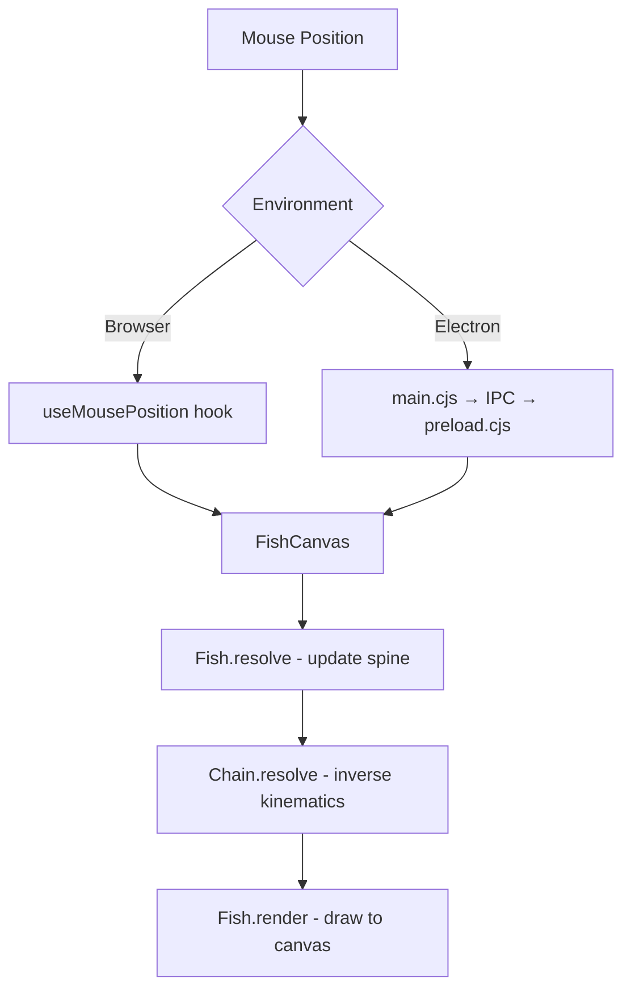

# AGENTS.md

This file provides guidance to Verdent when working with code in this repository.

## Table of Contents
1. Installation & Setup
2. Running the Application
3. Fish Scale Control
4. Commands
5. Architecture
6. Key Rules & Constraints
7. Development Hints

## Installation & Setup

### Prerequisites
- Node.js (v18+)
- pnpm package manager

### Install Steps
```bash
cd fish_anim_ts
pnpm install
```

If prompted about build scripts (esbuild, electron), approve them or add to `package.json`:
```json
"pnpm": {
  "onlyBuiltDependencies": ["esbuild", "electron"]
}
```

## Running the Application

### Web Browser Mode
```bash
pnpm run dev
```
Opens at http://localhost:5173 - fish follows mouse in browser window.

### Desktop Overlay Mode (Electron)
```bash
pnpm run electron:dev
```
- Creates transparent, always-on-top, click-through overlay
- Fish follows mouse cursor across entire screen (multi-display supported)
- Press **ESC** to quit

### Build Commands
```bash
pnpm run build          # Build web version to dist/
pnpm run electron:build # Build distributable desktop app
```

## Fish Scale Control

The fish size is controlled by the `scale` parameter in the Fish constructor.

### Location
`src/components/FishCanvas.tsx` - in the resize callback:
```typescript
fishRef.current = new Fish(new Vec2(width / 2, height / 2), 0.5);
//                                                          ^^^
//                                                        scale value
```

### Scale Values
| Scale | Description |
|-------|-------------|
| 1.0   | Original size (large) |
| 0.5   | Half size (default) |
| 0.3   | Small |
| 0.1   | Very small |

### What Gets Scaled
- Spine link size (body length)
- Body widths
- Movement step size
- Stroke/line width
- All fin sizes (pectoral, ventral, caudal, dorsal)
- Eye radius

## Commands

- `pnpm run dev` - Start Vite dev server (web)
- `pnpm run build` - TypeScript check + Vite production build
- `pnpm run preview` - Preview production build
- `pnpm run electron:dev` - Start Electron desktop app in dev mode
- `pnpm run electron:build` - Build distributable Electron app
- `pnpm run electron:start` - Start Electron with production build

## Architecture

```
fish_anim_ts/
├── electron/
│   ├── main.cjs       # Electron main process (window, mouse tracking)
│   └── preload.cjs    # IPC bridge for mouse position
├── src/
│   ├── lib/
│   │   ├── vec2.ts    # 2D vector math
│   │   ├── chain.ts   # Inverse kinematics (spine)
│   │   ├── fish.ts    # Fish rendering logic
│   │   └── spline.ts  # Catmull-Rom spline interpolation
│   ├── hooks/
│   │   ├── useAnimationLoop.ts  # requestAnimationFrame wrapper
│   │   └── useMousePosition.ts  # Mouse tracking hook (browser)
│   ├── components/
│   │   └── FishCanvas.tsx       # Main canvas component
│   ├── App.tsx        # Root React component
│   ├── main.tsx       # React entry point
│   └── index.css      # Global styles (transparent background)
```

### Data Flow


### Key Components
- **Vec2**: Immutable 2D vector class with math operations
- **Chain**: Inverse kinematics engine with angle constraints
- **Fish**: Rendering class that draws body, fins, eyes using Canvas 2D API
- **FishCanvas**: React component handling canvas setup, DPR scaling, animation loop

## Key Rules & Constraints

- **Transparent window**: CSS and HTML must have `background: transparent`
- **Click-through**: Electron window uses `setIgnoreMouseEvents(true)`
- **Multi-display**: Mouse coordinates use `mainWindow.getBounds()` for correct offset
- **DPR handling**: Canvas uses `setTransform(dpr, 0, 0, dpr, 0, 0)` for retina displays
- **Slow mouse fix**: `resolve()` limits step size to prevent oscillation when mouse is close

## Development Hints

### Changing Fish Colors
In `src/lib/fish.ts`:
```typescript
bodyColor = 'rgb(58, 124, 165)';  // Main body
finColor = 'rgb(129, 195, 215)';  // All fins
```

### Adding New Fin Types
1. Add draw method in `Fish` class following pattern of `drawPectoralFins`
2. Call it in `render()` method in correct z-order

### Adjusting Fish Movement Speed
In `src/lib/fish.ts`, modify the step calculation:
```typescript
const step = Math.min(16 * this.scale, dist);  // 16 is base speed
```

### Changing Spine Flexibility
In Fish constructor, modify angle constraint:
```typescript
this.spine = new Chain(origin, 12, linkSize, Math.PI / 8);
//                                           ^^^^^^^^^^
//                                           smaller = more rigid
```
