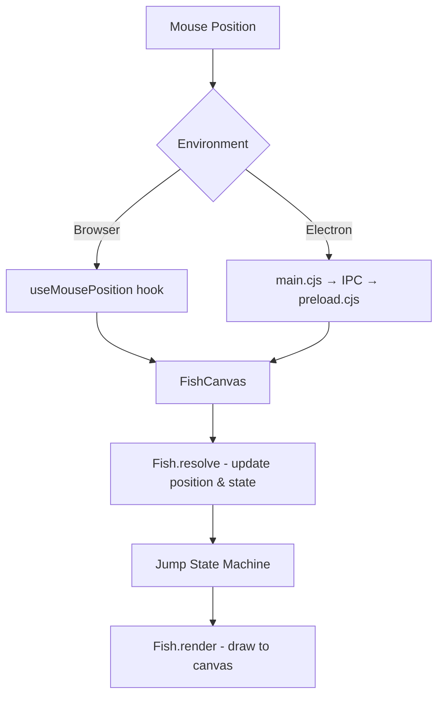
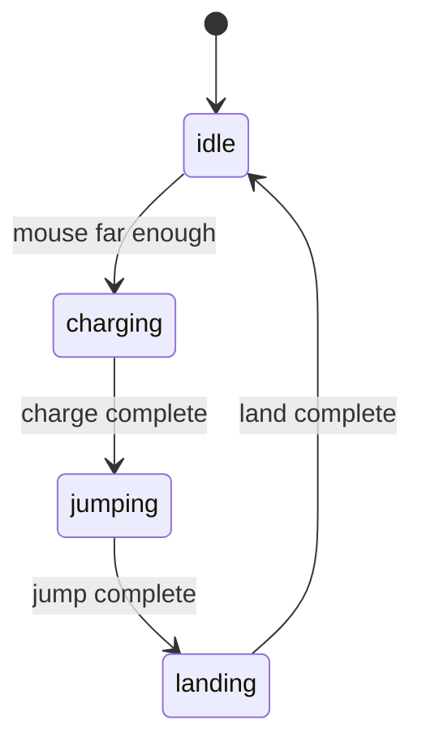

# AGENTS.md

This file provides guidance to Verdent when working with code in this repository.

## Table of Contents
1. Installation & Setup
2. Running the Application
3. Sprite Scale Control
4. Commands
5. Architecture
6. Key Rules & Constraints
7. Development Hints

## Installation & Setup

### Prerequisites
- Node.js (v18+)
- pnpm package manager

### Install Steps
```bash
cd fish_anim_ts
pnpm install
```

If prompted about build scripts (esbuild, electron), approve them or add to `package.json`:
```json
"pnpm": {
  "onlyBuiltDependencies": ["esbuild", "electron"]
}
```

## Running the Application

### Web Browser Mode
```bash
pnpm run dev
```
Opens at http://localhost:5173 - sprite follows mouse in browser window.

### Desktop Overlay Mode (Electron)
```bash
pnpm run electron:dev
```
- Creates transparent, always-on-top, click-through overlay
- Sprite follows mouse cursor across entire screen (multi-display supported)
- Press **ESC** to quit

### Build Commands
```bash
pnpm run build          # Build web version to dist/
pnpm run electron:build # Build distributable desktop app
```

## Sprite Scale Control

The sprite size is controlled by the `scale` parameter in the Fish constructor.

### Location
`src/components/FishCanvas.tsx` - in the resize callback:
```typescript
fishRef.current = new Fish(new Vec2(width / 2, height / 2), 1.0);
//                                                          ^^^
//                                                        scale value
```

### Scale Values
| Scale | Description |
|-------|-------------|
| 1.0   | Default size |
| 0.5   | Half size |
| 1.5   | Larger |
| 2.0   | Double size |

### What Gets Scaled
- Body size (width/height)
- Jump height and distance
- Ear (leaf) size
- Eye size
- Shadow size
- Glow intensity

## Commands

- `pnpm run dev` - Start Vite dev server (web)
- `pnpm run build` - TypeScript check + Vite production build
- `pnpm run preview` - Preview production build
- `pnpm run electron:dev` - Start Electron desktop app in dev mode
- `pnpm run electron:build` - Build distributable Electron app
- `pnpm run electron:start` - Start Electron with production build

## Architecture

```
fish_anim_ts/
├── electron/
│   ├── main.cjs       # Electron main process (window, mouse tracking)
│   └── preload.cjs    # IPC bridge for mouse position
├── src/
│   ├── lib/
│   │   ├── vec2.ts    # 2D vector math (immutable)
│   │   ├── chain.ts   # Inverse kinematics (unused, legacy)
│   │   ├── fish.ts    # Sprite rendering & jump physics
│   │   └── spline.ts  # Catmull-Rom spline interpolation (unused)
│   ├── hooks/
│   │   ├── useAnimationLoop.ts  # requestAnimationFrame wrapper
│   │   └── useMousePosition.ts  # Mouse tracking hook (browser)
│   ├── components/
│   │   └── FishCanvas.tsx       # Main canvas component
│   ├── App.tsx        # Root React component
│   ├── main.tsx       # React entry point
│   └── index.css      # Global styles (transparent background)
```

### Data Flow


### Sprite State Machine


### Key Components
- **Vec2**: Immutable 2D vector class with math operations
- **Fish**: Main sprite class with jump physics and rendering
  - State machine: idle → charging → jumping → landing
  - Squash & stretch animation
  - Shadow rendering during jumps
- **FishCanvas**: React component handling canvas setup, DPR scaling, animation loop

## Key Rules & Constraints

- **Transparent window**: CSS and HTML must have `background: transparent`
- **Click-through**: Electron window uses `setIgnoreMouseEvents(true)`
- **Multi-display**: Mouse coordinates use `mainWindow.getBounds()` for correct offset
- **DPR handling**: Canvas uses `setTransform(dpr, 0, 0, dpr, 0, 0)` for retina displays
- **Immutable Vec2**: Always create new Vec2 instances, never mutate

## Development Hints

### Changing Sprite Colors
In `src/lib/fish.ts`:
```typescript
bodyColor = 'rgba(0, 255, 210, 1)';  // Cyan body with glow
leafColor = 'rgba(0, 220, 100, 1)';  // Green leaf ears
```

### Adjusting Jump Parameters
In `src/lib/fish.ts` constructor or class properties:
```typescript
baseJumpHeight = 60;    // How high it jumps (pixels * scale)
baseJumpDistance = 100; // How far per jump (pixels * scale)
jumpDuration = 0.35;    // Jump time in seconds
chargeDuration = 0.12;  // Crouch time before jump
landDuration = 0.08;    // Squash time on landing
idleThreshold = 0.02;   // Delay before starting next jump
```

### Adjusting Squash & Stretch
In state handlers (`handleCharging`, `handleJumping`, `handleLanding`):
```typescript
this.stretchX = 1 + 0.25 * t;  // Horizontal stretch factor
this.stretchY = 1 - 0.2 * t;   // Vertical squash factor
```

### Adding Visual Effects
The sprite uses canvas shadow for glow effect:
```typescript
ctx.shadowBlur = 20 * this.scale;
ctx.shadowColor = this.bodyColor;
```
